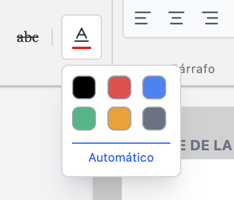
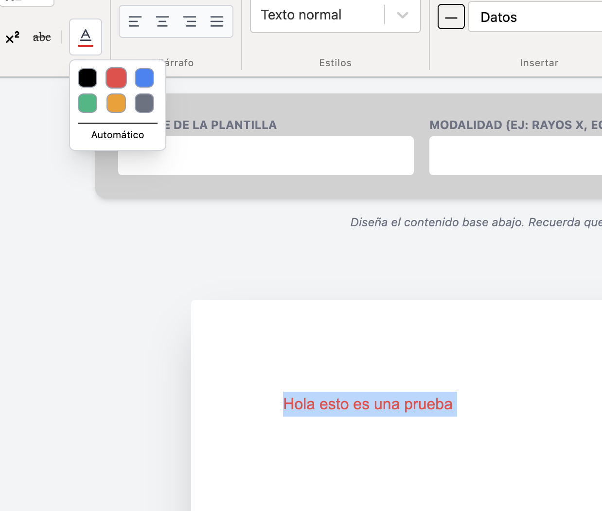
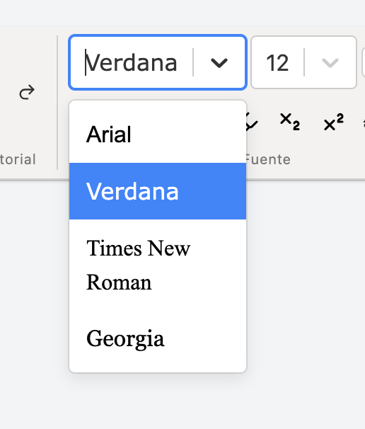
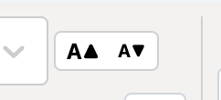
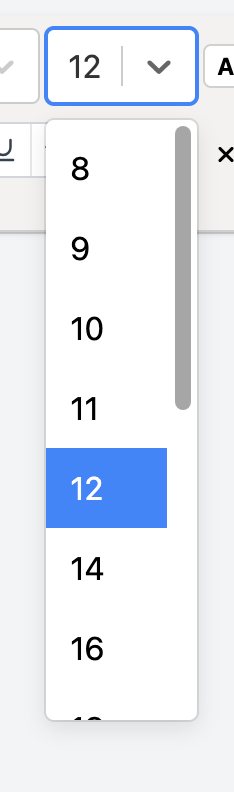
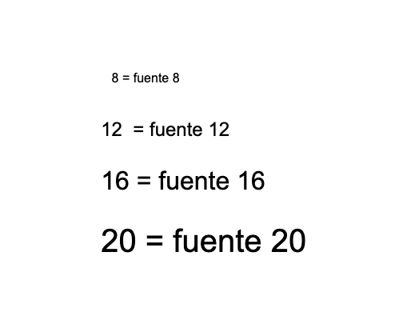
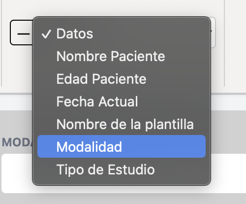
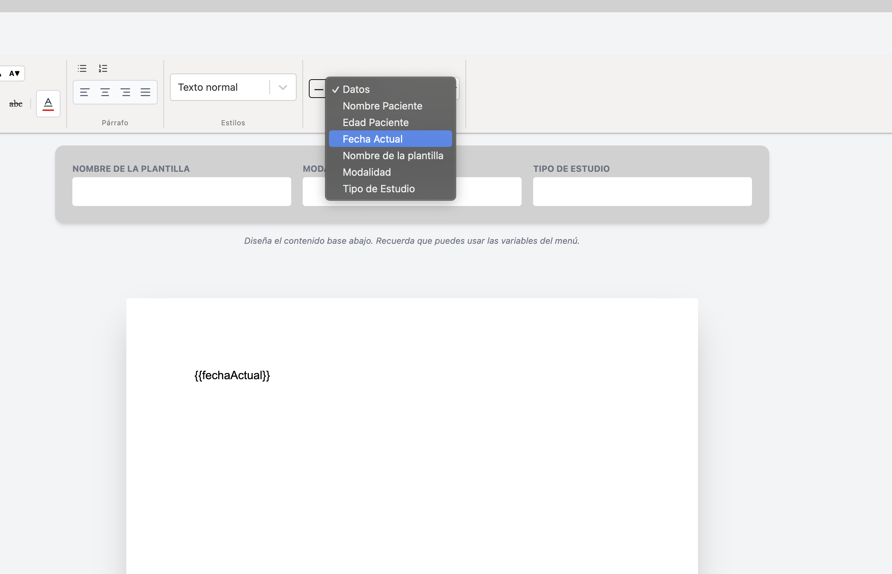

# EDITOR REGEX 

Editor de documentos desarrollado con React y Tiptap.
Permite crear plantillas dinamicas variables personalizadas que posteriormente pueden ser reemplazados por datos reales mediante expresiones regulares. 
## Características

- Editor de texto enriquecido basado en Tiptap
- Variables dinámicas
- Sistema de reemplazo mediante Regex
- Impresión de documentos
- Inserción de imágenes
- Formularios reutilizables
- Componentes completamente modulares
- Integración con cualquier API o backend
## Instalación

- npm install
- npm run dev

## Estructura 
 

```
└── 📁src
    └── 📁components
        └── 📁Editor-Regex
            └── 📁componentsWord
                ├── FontColorPicker.jsx
                ├── FontFamilySelect.jsx
                ├── FontSizeAdjust.jsx
                ├── FontSizeSelect.jsx
                ├── HeadingSelect.jsx
                ├── HighlightButton.jsx
                ├── HorizontalRuleButton.jsx
                ├── InsertImageButton.jsx
                ├── InsertVariableSelect.jsx
                ├── SubscriptButton.jsx
                ├── SuperscriptButton.jsx
                ├── TextAlignGroup.jsx
                ├── UnderlineSelect.jsx
            └── 📁extensions
                ├── FontSize.js
                ├── Underline.js
            └── 📁styles
                ├── documento.css
                ├── styletiptap.css
                ├── toolbar.css
            └── 📁utils
                ├── MotorRegex.js
            ├── CreatePage.jsx
            ├── DocumentEditor.jsx
            ├── EditorRegex.jsx
            ├── FormTemplate.jsx
            ├── index.jsx
            ├── Tiptap.jsx
            ├── Wordtoolbar.jsx
        ├── List.jsx
        ├── ModalComponente.jsx
        ├── NavbarCompo.jsx
        ├── SearchComponent.jsx
    └── 📁pages
        ├── EditPlantilla.jsx
        ├── Inicio.jsx
        ├── NewPlantilla.jsx
        ├── reports.jsx
    └── 📁services
        ├── api.js
        ├── pacienteService.js
        ├── plantillaService.js
        ├── reportService.js
    ├── App.jsx
    ├── index.css
    ├── main.jsx
    └── scss.d.ts
```
## Arquitectura

El proyecto fue diseñado bajo una arquitectura modular.

### Components

Contienen componentes reutilizables y no conocen nada sobre APIs, Axios o bases de datos.

Ejemplos:

- EditorRegex
- WordToolbar
- FormTemplate
- ModalComponente
- List

#### Carpeta Editor-Regex 

Esta carpeta se creo con el proposito de guardar todo lo relacionado al editor-regex, mas que todo para organizacion. 

Dentro de esta carpeta se encuentra lo siguiente: 
- Componentes Word 
- Extensiones 
- Styles 
- utils 
- EditorRegex
- Formulario 
- Tiptap 
- Wordtoolbar 
- Documento

##### Componentes Word 
Los componentes de Word son las herramientas basicas que tiene un editor de texto, basado en el tradicional Microsoft Word, se creo esta carpeta para guardar todas estas herramientas, que son las siguientes: 
- FontColorPicker
- FontFamilySelect
- FontSizeAdjust 
- FontSizeSelect 
- HeadingSelect 
- HighlightButon 
- HorizontalRuleButton 
- InsertVariableSelect 
- InsertImageButton 
- SubscripButton 
- Superscriptbutton 
- TextAlignGroup
- UnderlineSelect 
###### FontColorPicker
El componente **FontColorPicker** es el componente que tiene la funcion del cambio de color del texto, tipo como el word tradicional. Tiene los colores como: el rojo, amarillo, verde, azul, gris y el negro, tambien tiene una opcion para colocar en el color que viene por automatico. 


Dentro del WordToolbar lo encontraras como en el word tradicional, puedes elegir cualquiera de los 6 colores que se ve en pantalla: negro, rojo, azul, amarillo y gris. 

**Como funciona este componente FontColor**

El **FontColorPicker**  funciona como se ve en la imagen, puede seleccionar el texto que escribiste y luego seleccionar el icono de FontColor que tiene la forma de una A mayuscula, al seleccionarlo se abrira un menu flotante de colores, donde selecionas uno y el texto tendra el color que seleccionaste. 
tambien puedes seleccionar primero el color y al escribir el texto saldra del color que elegiste. 
###### FontFamilySelect
El componente **FontFamilySelect** es un select donde puedes elegir el tipo de fuente: 
```
const fontOptions = [
  { value: "Arial", label: "Arial" },
  { value: "Verdana", label: "Verdana" },
  { value: "Times New Roman", label: "Times New Roman" },
  { value: "Georgia", label: "Georgia" },
];
```
por el momento cuenta con las siguientes fuentes: Arial, Verdana, Times New Roman y Georgia. 

Al igual que en el Word, se puede apreciar dentro de las herramientas, un select que dice: Arial, el select se puede abrir al darle clic y aparecera como un menu flotante las demas fuentes que contiene: 

**Como funciona este componente FontFamilySelect**

Con solamente seleccionar una de las fuentes del menu flotante de **FontFamilySelect** , todo lo que escribas en el documento estara con la fuente que elegiste. 
Tambien puedes seleccionar un texto y luego seleccionar la fuente que elijas para el texto seleccionado. 

###### FontSizeAdjust 
El componente **FontSizeAdjust** al igual que en el word Tradicional, sirve para aumentar o disminuir el tamaño de la letra dentro del documento. 
En el wordToolbar lo puedes encontrar de esta manera, con el simbolo de una A mayuscula con una flecha apuntando hacia arriba y una A mayuscula con una flecha apuntado hacia abajo que es para disminuir, de la siguiente manera: 

**Como funciona este componente FontSizeAdjust**
Solo seleccionas cualquiera de los dos simbolos. 
- Para **aumentar**, seleccionas la A mayuscula que tiene una flecha apuntando hacia arriba. 
- Para **disminuir** el tamaño, seleccionas la A mayuscula que tiene una flecha apuntando hacia abajo. 

Puedes hacerlo seleccionando el texto o incluso sin seleccionarlo y solamente seleccionar uno de los dos: **aumentar** / **disminuir**

###### FontSizeSelect 
Este componente tiene la misma funcion que el componente FontSize del word tradicional. 
En el wordToolbar lo puedes encontrar como un select y un numero 12, que es la fuente por defecto que viene el documento. 
Dentro del componente tiene los siguientes tamaños: 
```
const sizeOptions = [
  { value: "8px", label: "8" },
  { value: "9px", label: "9" },
  { value: "10px", label: "10" },
  { value: "11px", label: "11" },
  { value: "12px", label: "12" },
  { value: "14px", label: "14" },
  { value: "16px", label: "16" },
  { value: "18px", label: "18" },
  { value: "20px", label: "20" },
  { value: "24px", label: "24" },
  { value: "28px", label: "28" },
  { value: "32px", label: "32" },
  { value: "36px", label: "36" },
  { value: "48px", label: "48" },
  { value: "72px", label: "72" },
];
```
puedes seleccionar cualquiera y el texto cambiara de tamaño segun el número que seleccionaste. 
**Como funciona este componente FontSizeSelect**

Dale clic al select que tiene el número 12 y se abrira un menu emergente, donde estara los numeros desde el 8 hasta el número 72. 
Seleccionas el número que prefieras y el texto del documento cambiara su tamaño, aumentara o disminuira segun el número que seleccionaste. 


###### HeadingSelect
###### HighlightButton

El componente **InsertVariableSelect** es el componente que se utiliza para insertar variables dentro de un select, su funcion es mas que todo para ayudar al usuario como tipo recordatorio de que variables puede usar en la plantilla y de una manera facil, lo selecciona y se colocara automaticamente en la hoja: 


un select aparecera en el wordToolbar donde se podra elegir cualquier variable. 



Al seleccionar aparecera automaticamente en el DocumentoEditor (la hoja)
evitando asi que el usuario tenga que escribir o adivinar que variable necesita 


### Pages

Actúan como contenedores visuales.
- CreatePage 

Son responsables de conectar componentes con datos.

Ejemplos:

- Inicio
- Reports
- NewPlantilla
- EditPlantilla

### Services

Encapsulan todas las llamadas HTTP.

Ejemplos:

- plantillaService
- pacienteService
- reportService

Esto permite reutilizar los componentes en cualquier proyecto sin modificar su código interno.
